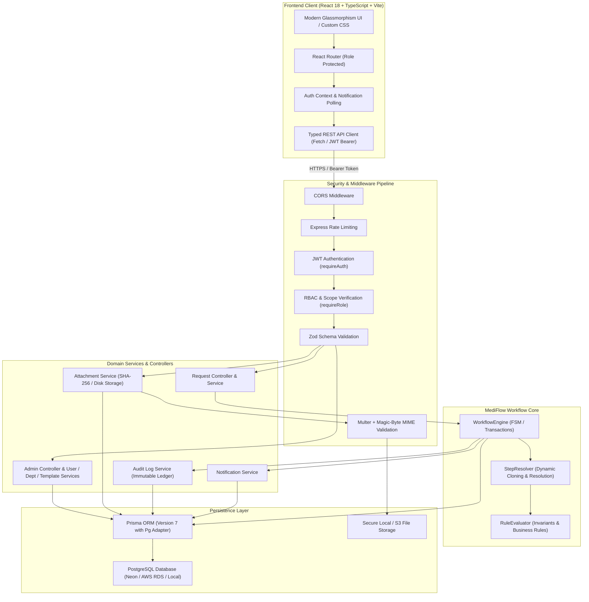
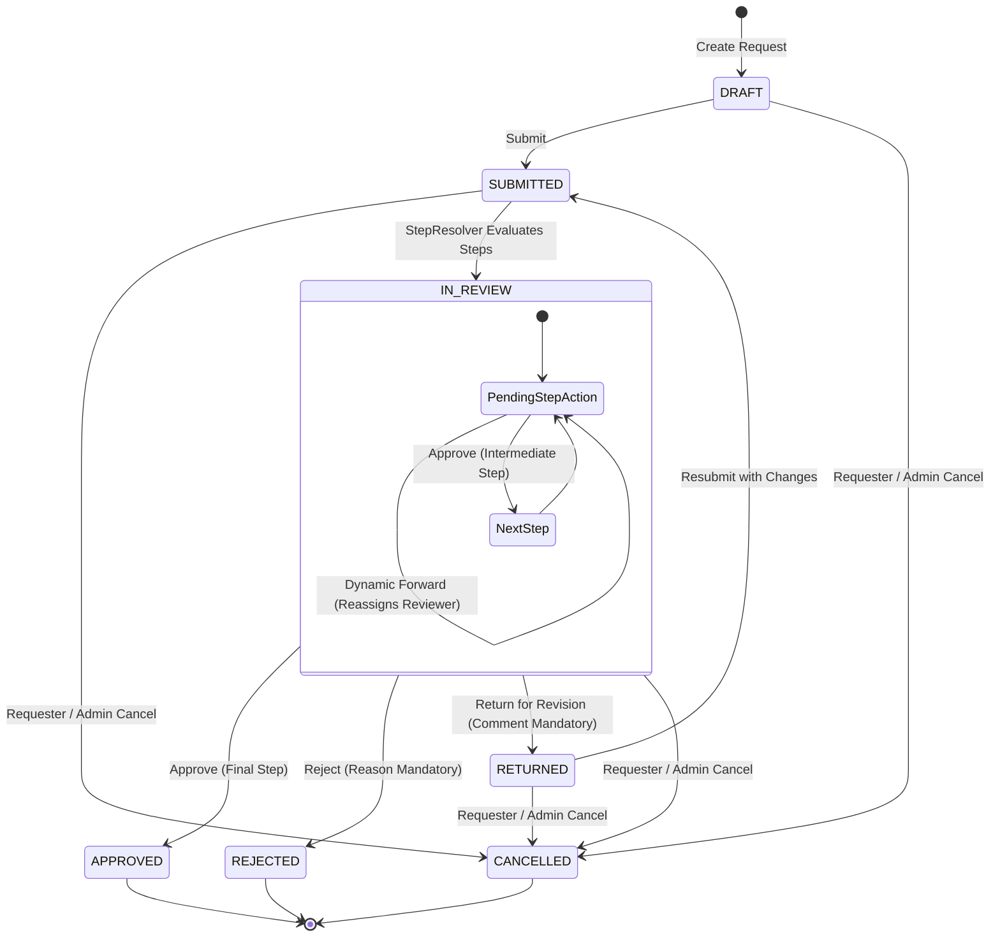
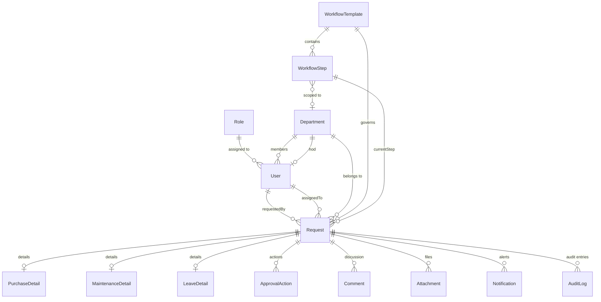

# MediFlow System Architecture Specification

## 1. Executive Summary & Purpose

**MediFlow** is an enterprise-grade Hospital Approval Workflow & Operations Management Platform. It digitizes, accelerates, enforces compliance for, and audits operational requests across clinical, engineering, procurement, and administrative hospital departments.

MediFlow ensures strict governance over hospital expenditures, asset maintenance, and personnel scheduling through:
- **Rule-Driven Finite State Machine (FSM)** with dynamic step resolution.
- **System-Enforced Invariants**: Non-bypassable Finance-First clearance for high-value purchases (> ₹1,00,000) and strict No-Self-Approval prevention.
- **Dynamic Peer Forwarding**: Seamless delegation of approvals to qualified departmental personnel.
- **Immutable Append-Only Audit Logging**: Comprehensive accountability tracking actors, timestamps, state transitions, administrative overrides, and file uploads.
- **Workflow Versioning & In-Flight Stability**: Zero-disruption template evolution where active in-flight requests remain pinned to their creation schema.

---

## 2. High-Level Architecture Diagram

---

## 3. Technology Stack

| Layer | Technology | Key Libraries / Modules |
| :--- | :--- | :--- |
| **Frontend** | React 18, TypeScript, Vite | React Router DOM v7, Lucide Icons, Custom CSS Design System, Tailwind CSS |
| **Backend** | Node.js, Express.js 5, TypeScript | `jsonwebtoken`, `bcrypt`, `winston`, `zod`, `multer`, `cors`, `express-rate-limit` |
| **ORM & Database** | Prisma ORM 7, PostgreSQL | `@prisma/client`, `@prisma/adapter-pg`, `pg` connection pool |
| **Testing & QA** | Vitest, Supertest | `@vitest/coverage-v8`, custom in-memory and integration test harnesses |
| **Security** | JWT (Bearer), Bcrypt (10 rounds) | Magic-byte MIME type validation, path traversal prevention, role-based scoping |

---

## 4. Request Lifecycle & Finite State Machine (FSM)

MediFlow manages operational requests across seven discrete statuses:

### State Definitions:
1. **`DRAFT`**: The request has been created and saved by the employee, but has not yet entered the approval queue. Requesters can edit all fields, upload quotes, or delete the draft.
2. **`SUBMITTED`**: Transient state during workflow engine initialization where dynamic rules and step templates are materialized.
3. **`IN_REVIEW`**: Active workflow state. The request is assigned to an approver role (and optionally a specific user) at `currentStepId`.
4. **`APPROVED`**: The final workflow step has been approved. The requisition is sealed, purchase orders/work orders can be issued, and no further state changes are permitted.
5. **`REJECTED`**: A reviewer rejected the request with mandatory justification. The workflow terminates immediately.
6. **`RETURNED`**: A reviewer requested corrections or additional information (e.g. additional supplier quotations). The request returns to the originator who can edit and resubmit.
7. **`CANCELLED`**: The originator or an administrator cancelled the request prior to completion.

---

## 5. Dynamic Workflow Engine & Invariant Architecture

### 5.1 Dynamic Step Resolver
When a request is submitted or edited in `DRAFT`/`RETURNED` state, the `StepResolver` evaluates the request context against the active base template:
1. **Rule Evaluation**: `RuleEvaluator` computes rule modifications (adding steps, replacing steps, changing step order).
2. **Dynamic Cloned Templates**: If rules alter the baseline step sequence, a dedicated dynamic template is created (e.g., `Dynamic: Standard Purchase Request for REQ-PUR-2026-002`) with `isActive: false`.
3. **In-Flight Immutability**: Requests in `IN_REVIEW`, `APPROVED`, or `REJECTED` are permanently bound to their materialized steps. Activating a new workflow template version never affects in-flight requests.

### 5.2 System Invariants
- **Finance-First Invariant (> ₹1,00,000)**: Any purchase requisition exceeding ₹1,00,000 is automatically prepended with **Step 1: Finance Department Review** (`FINANCE_OFFICER` in department `FIN`). This cannot be bypassed by custom admin templates or administrative overrides.
- **No-Self-Approval Invariant**: If a Head of Department (`HOD`) creates a request:
  - *Purchase*: HOD approval is omitted; routed directly to Procurement / Finance / Director.
  - *Maintenance*: HOD step is dynamically replaced with **Director Approval**.
  - *Leave*: HOD step is dynamically replaced with **Medical Superintendent Approval**.
- **Dynamic Forwarding Scope**: Reviewers may delegate an active step to a peer. The peer must match the step's required role, be active, belong to the requisite department scope, and cannot be the original requester or current actor.

---

## 6. Database Relational Model

---

## 7. Security & Compliance Model

1. **Authentication & Password Security**:
   - Passwords hashed using `bcrypt` with salt rounds = 10.
   - JWT tokens signed with SHA-256 HMAC, verifying `userId` and `role`.
2. **Authorization & RBAC**:
   - Express middleware `requireAuth` validates token identity.
   - `requireRole(...)` verifies system role permissions.
   - Controller-level departmental scoping verifies HOD and Finance authority.
3. **File Upload Security**:
   - Multer middleware enforces 10 MB maximum file size.
   - Whitelist validation for file extensions (`.pdf`, `.jpg`, `.jpeg`, `.png`, `.doc`, `.docx`, `.xls`, `.xlsx`).
   - Magic-byte binary header inspection verifies true MIME types and prevents disguised executables (`.exe`, `.sh`, `.bat`).
   - Unique timestamped filenames prevent path traversal and overwrites.
4. **Audit Trail**:
   - Append-only `AuditLog` table records every state change, approval, rejection, forwarding, administrative override, and document upload with actor ID, timestamp, and human-readable description.
